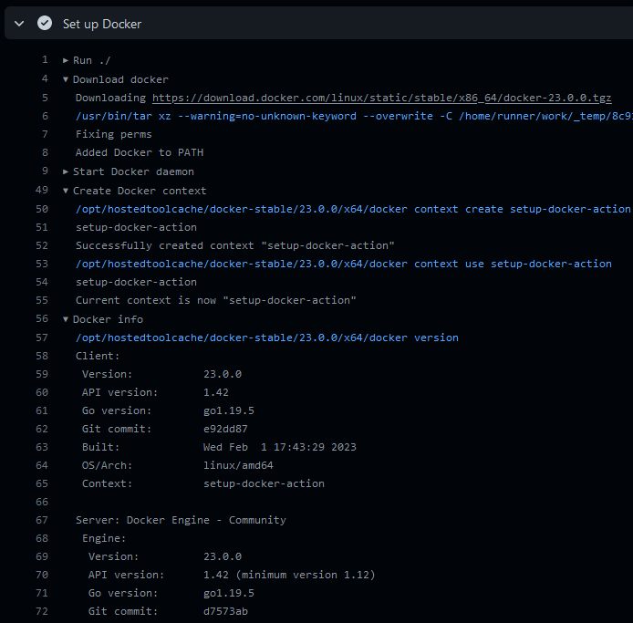

[](https://github.com/crazy-max/ghaction-setup-docker/releases/latest)
[](https://github.com/marketplace/actions/docker-setup-docker)
[](https://github.com/crazy-max/ghaction-setup-docker/actions?workflow=ci)
[](https://github.com/crazy-max/ghaction-setup-docker/actions?workflow=test)
[](https://codecov.io/gh/crazy-max/ghaction-setup-docker)

## About

GitHub Action to set up (download and install) [Docker CE](https://docs.docker.com/engine/).
Works on Linux, macOS and Windows.



___

* [Usage](#usage)
  * [Quick start](#quick-start)
  * [Daemon configuration](#daemon-configuration)
  * [Define custom `limactl start` arguments (macOS)](#define-custom-limactl-start-arguments-macos)
* [Customizing](#customizing)
  * [inputs](#inputs)
  * [outputs](#outputs)
* [Contributing](#contributing)
* [License](#license)

## Usage

### Quick start

```yaml
name: ci

on:
  push:

jobs:
  docker:
    runs-on: ubuntu-latest
    steps:
      -
        name: Set up Docker
        uses: crazy-max/ghaction-setup-docker@v3
```

### Daemon configuration

You can [configure the Docker daemon](https://docs.docker.com/engine/reference/commandline/dockerd/#daemon-configuration-file)
using the `daemon-config` input. In the following example, we configure the
Docker daemon to enable debug and the [containerd image store](https://docs.docker.com/storage/containerd/)
feature:

```yaml
name: ci

on:
  push:

jobs:
  docker:
    runs-on: ubuntu-latest
    steps:
      -
        name: Set up Docker
        uses: crazy-max/ghaction-setup-docker@v3
        with:
          daemon-config: |
            {
              "debug": true,
              "features": {
                "containerd-snapshotter": true
              }
            }
```

### Define custom `limactl start` arguments (macOS)

You can define custom [`limactl start` arguments](https://lima-vm.io/docs/reference/limactl_start/)
using the `LIMA_START_ARGS` environment variable to customize the VM:

```yaml
name: ci

on:
  push:

jobs:
  docker:
    runs-on: macos-latest
    steps:
      -
        name: Set up Docker
        uses: crazy-max/ghaction-setup-docker@v3
        env:
          LIMA_START_ARGS: --cpus 4 --memory 8
```

## Customizing

### inputs

The following inputs can be used as `step.with` keys

| Name            | Type   | Default               | Description                                                                                                                 |
|-----------------|--------|-----------------------|-----------------------------------------------------------------------------------------------------------------------------|
| `version`       | String | `latest`              | Docker CE version (e.g., `v24.0.6`).                                                                                        |
| `channel`       | String | `stable`              | Docker CE [channel](https://download.docker.com/linux/static/) (e.g, `stable`, `edge` or `test`).                           |
| `daemon-config` | String |                       | [Docker daemon JSON configuration](https://docs.docker.com/engine/reference/commandline/dockerd/#daemon-configuration-file) |
| `context`       | String | `setup-docker-action` | Docker context name.                                                                                                        |

### outputs

The following outputs are available

| Name   | Type   | Description        |
|--------|--------|--------------------|
| `sock` | String | Docker socket path |

## Contributing

Want to contribute? Awesome! The most basic way to show your support is to star
the project, or to raise issues. You can also support this project by [**becoming a sponsor on GitHub**](https://github.com/sponsors/crazy-max)
or by making a [PayPal donation](https://www.paypal.me/crazyws) to ensure this
journey continues indefinitely!

Thanks again for your support, it is much appreciated! :pray:

## License

Apache-2.0. See `LICENSE` for more details.
